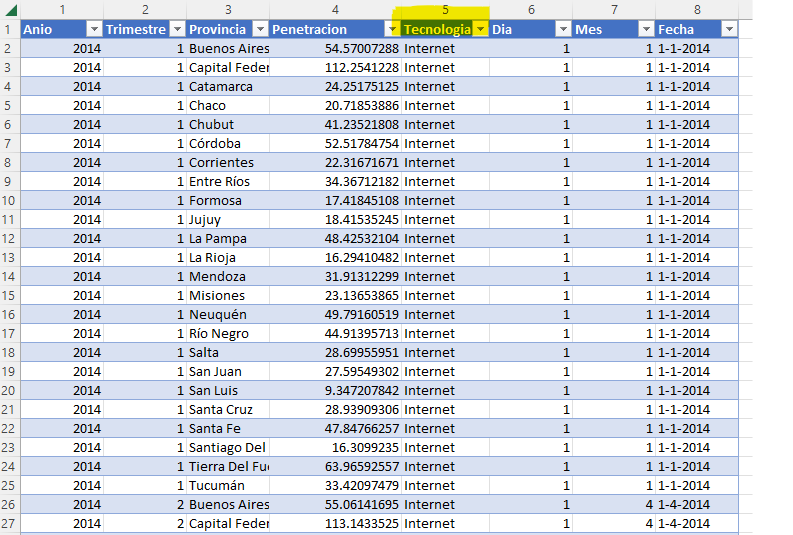
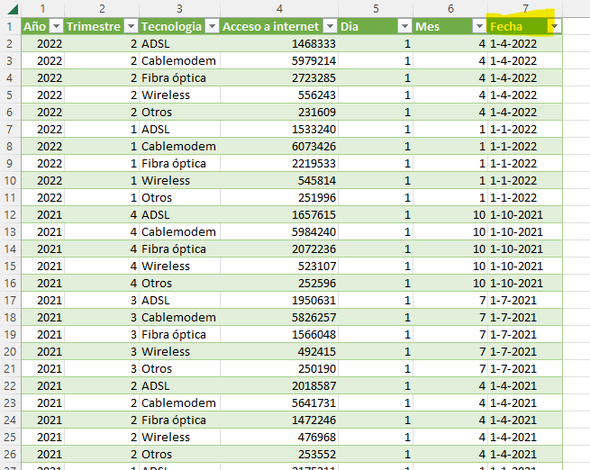
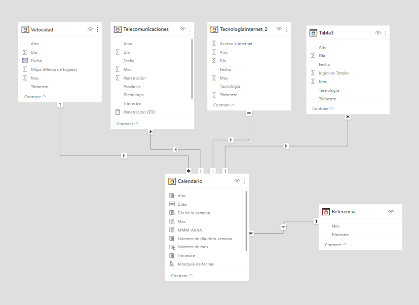
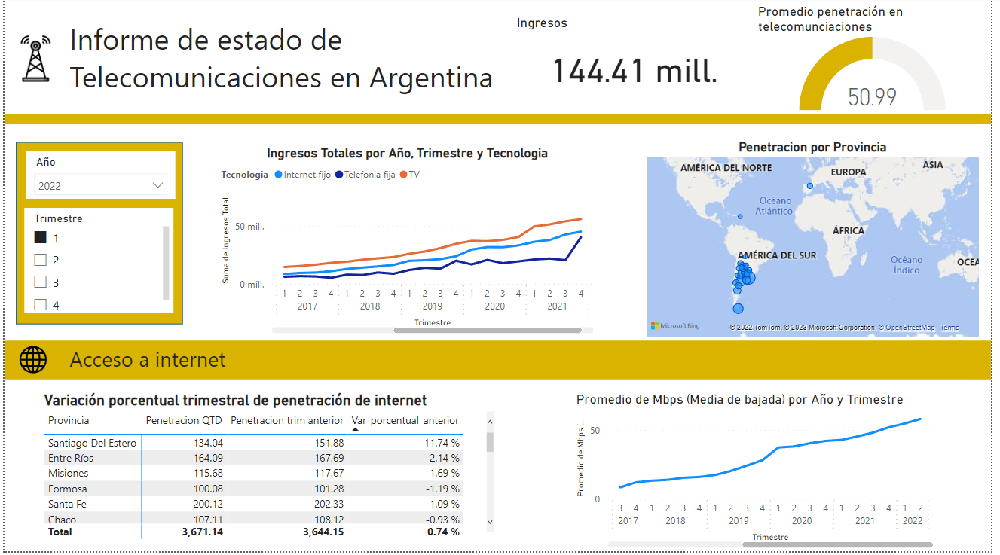

# <h1 align="center"> 

# <h1 align="center"> **PROYECTO INDIVIDUAL Nº3**

# <h1 align="center">**Telecomunicaciones**

# <h1 align="center">**`Luz Mayte Estrada Torvisco`**</h1>

### **Contexto**
La industria de las telecomunicaciones ha jugado un papel vital en nuestra sociedad, facilitando la información a escala internacional y permitiendo la comunicación continua incluso en medio de una pandemia mundial. La transferencia de datos y comunicación se realiza en su mayoría a través de internet, líneas telefónicas fijas, telefonía móvil, casi en cualquier lugar del mundo. 

En comparación con la media mundial, Argentina está a la vanguardia del desarrollo de las telecomunicaciones, teniendo para el 2020 un total de [62,12 millones conexiones](https://www.datosmundial.com/america/argentina/telecomunicacion.php). 

En este contexto, una empresa prestadora de servicios de telecomunicaciones desea reconocer el comportamiento de este sector a nivel nacional. La principal actividad de la empresa es brindar **acceso a internet**, pero también es importante considerar el resto de los servicios. 

### **Objetivo:**

Realizar un análisis descriptivo del mercado de telecomunicaciones en Argentina.

### **Análisis exploratorio de los datos**

Se realizó un análisis exploratorio de los datos abiertos compartidos en el siguiente [(link)](https://datosabiertos.enacom.gob.ar/home).

En este análisis se observa lo siguiente:

- Existe una medida llamanda penetración, que indica la cantidad de hogares por cada 100 que tiene acceso al servicio de telecomunicación (TV, internet, telefonía fija). El detalle con estos datos es que están separados en tres tablas diferentes. Motivo por la cual se construyó una tabla nueva uniendo todas ellas, agregando una columna denominada tecnología para identificar si se trataba de cualquiera de los tres tecnologías de telecomunicación descritos arriba. Asimismo, la parte de telefonía móvil tiene la unidad de medida en acceso por cada 100 habitantes al tratarse de un acceso más personalizado. Motivo por el cual, no se tomó en cuenta en este análisis, y sólo quedaron los servicios que se pueden medir por hogar.

- Las provincias debían estar georreferenciadas, ya que con sólo el nombre de provincias no es tan preciso, y salía ciudades de Europa. Se buscó una base de datos con las latitudes y longitudes de las provincias de Argentina, y se trabajó en el modelo de datos. [(provincias)](https://datos.gob.ar/ar/dataset/jgm-servicio-normalizacion-datos-geograficos/archivo/jgm_8.9)

- Las medidas de penetración se comparten ya sea de forma trimestral entre los años 2014- 2022 y también está segmentada por provincia. 

- Los ingresos debido a estos servicios también se comparten de forma trimestral. No existe información de los ingresos por provincias, ni por tecnología más detallada.

- En el caso específico de acceso a internet, existe una medida que es el promedio de Mpbs. Este es un indicador de la calidad del servicio de internet que se ofrece, y se muestra de forma trimestral.

- En todos los casos anteriores se maneja fechas para análisis trimestrales, y/o anuales, motivo por el cual se construyó una columna fecha. Esta columna se categoriza como fecha, y permite analizarse a través de funciones como la creación de tabla calendario. 

_Todas las modificaciones de las tablas se realizaron en Excel_

- Las tablas estudiadas se pueden relacionar según el siguiente modelo relacional. Donde se construyó una tabla calendario, y operar con las funcionalidades de Power BI para los análisis trimestrales, y segmentación según el cálculo de medidas.

### **KPIs**

En base a la información proporcionada se puede definir los siguientes indicadores de análisis descriptivo. Para ello, se debe tener en cuenta que se desea mostrar un panorama general del estado de las comunicaciones en el tiempo, y geográficamente cómo se encuentra el nivel de penetración, para luego hacer un análisis más detallado del nivel de penetración del servicio de internet, su calidad y los ingresos percibidos:

- El aumento o disminución de la variación porcentual **trimestral** del servicio de internet, cada 100 hogares por provincia
- Ingresos totales por año, trimestre y tecnología
- Penetración por provincia
- Promedio de Mbps por año y trimestre

Estos datos pueden segmentarse por año y trimestre.

### **Dashboard**

### **Análisis**
- Una empresa de telecomunicaciones desea saber cómo es el contexto en telecomunicaciones en Argentina. Es muy probable que tenga fines comerciales para poder invertir. Dentro de los indicadores que se definieron para su análisis son: 1) Tener un entendimiento de todo el contexto de telecomunicaciones en general, 2) Tener un mayor detalle de la parte de conexión a internet. 

- Se definieron dos indicadores principales: 1) el nivel de penetracion por cada 100 hogares, 2) los ingresos trimestrales. De esa forma la empresa podrá analizar las necesidades de expansión, y si es que es un mercado agradable para realizar inversiones.

- Se observa que existe un total de ingresos de 144.41 millones de pesos argentinos para el año 2022 en el primer trimestre sólo en servicios de internet, telefoniía y TV.

- El nivel de penetración promedio en general es de 50.99 sobre 100 hogares, lo que deja libre un 49% de mercado por explotar. 

- Según un análisis temporal, se muestra una tendencia creciente en el nivel de ingresos en las tecnologías de internet fijo, telefonía fija, y TV, observándose una tendencia más alta de crecimiento de TV. Asimismo, la telefonía fija muestra una variación menos predecible mostrandose picos de subida y bajada a lo largo de los años.

- Según el análisis georreferenciado del nivel de penetración, se observa un mercado potencia en la parte sur de Argentina, pues es la zona con menor nivel de telecomunicaciones.

- En el aspecto de internet, se realizó una tabla de variación porcentual de penetración de internet, en el que se observa una disminución significativa de 11.74% en la localidad de Santiago Del Estero.

- La calidad de servicio de internet a lo largo de los años ha ido aumentando, pues la velocidad de internet ha tenido un cambio de 8 Mpbs en 2017 a 58.4.